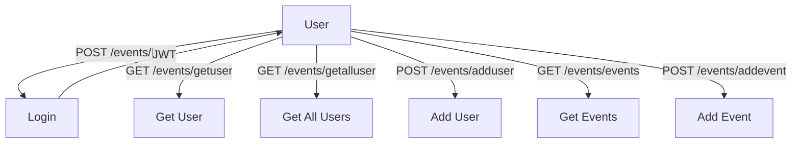
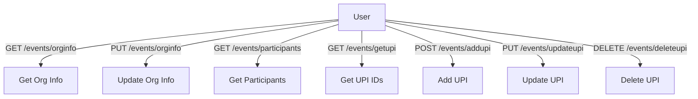

# 🚀✨ Smart Resource Access Gateway ✨🚀

> **A blazing-fast, secure API gateway for resource-scoped JWT authentication, event management, and more!**

[](https://github.com/your-username/smart-access-gateway/actions)
[](https://www.python.org/)
[](LICENSE)

---

## 📖 What is this project about?

Smart Resource Access Gateway is a FastAPI-based API gateway that authenticates users, issues resource-scoped JWT tokens, and provides a robust event management backend. It features rate limiting (Redis), audit logging (AWS S3/DynamoDB), alerting (SNS), and is designed for scalable, secure backend engineering. The project is production-ready, cloud-deployable, and developer-friendly.

---

## 🧑‍💻 Event API Endpoints

> **Note:** 🏨 Hotel endpoints are **not yet implemented**. The following endpoints are for the Event system only.

### 📊 Visual API Flow

#### 1️⃣ Auth, User, and Event Endpoints


#### 2️⃣ Organization, Participant, and UPI Endpoints


---

### 📝 Endpoint Details

<details>
<summary>🔑 <b>POST /events/login</b></summary>

Authenticate and get a JWT token.

**Request:**
```json
{
  "username": "saad",
  "password": "1234"
}
```
**Response:**
```json
{
  "Token": "Bearer <JWT>",
  "Token Type": "access/jwt"
}
```
</details>

<details>
<summary>👤 <b>GET /events/getuser</b></summary>

Get current user info (JWT required).

**Header:**
```
Authorization: Bearer <JWT>
```
**Response:**
```json
{
  "id": 1,
  "username": "saad",
  ...
}
```
</details>

<details>
<summary>👥 <b>GET /events/getalluser</b></summary>

Get all users.

**Response:**
```json
[
  { "id": 1, "username": "saad", ... },
  { "id": 2, "username": "alex", ... }
]
```
</details>

<details>
<summary>➕ <b>POST /events/adduser</b></summary>

Add a new user (superuser JWT required).

**Request:**
```json
{
  "username": "alex",
  "password": "pass",
  "email": "alex@email.com",
  "first_name": "Alex",
  "last_name": "Smith"
}
```
**Response:**
```json
{ "User Added Succesfully" }
```
</details>

<details>
<summary>🗓️ <b>GET /events/events</b></summary>

Get all events (JWT required).

**Response:**
```json
[
  {
    "title": "Chess Tournament",
    "max_participants": 100,
    "status": "published",
    ...
  }
]
```
</details>

<details>
<summary>🆕 <b>POST /events/addevent</b></summary>

Add a new event.

**Request:**
```json
{
  "title": "Chess Tournament",
  "max_participants": 100,
  "status": "published",
  ...
}
```
</details>

<details>
<summary>🏢 <b>GET /events/orginfo</b></summary>

Get organization info.

**Response:**
```json
{
  "name": "Event Org",
  "add": "123 Main St",
  "wp": "+1234567890",
  "email": "org@email.com"
}
```
</details>

<details>
<summary>🏢 <b>PUT /events/orginfo</b></summary>

Update organization info.

**Request:**
```json
{
  "name": "Event Org",
  "add": "123 Main St",
  "wp": "+1234567890",
  "email": "org@email.com"
}
```
**Response:**
```json
{ "Details Updated Sucessfully" }
```
</details>

<details>
<summary>🧑‍🤝‍🧑 <b>GET /events/participants</b></summary>

Get all participants.

**Response:**
```json
[
  {
    "full_name": "John Doe",
    "registration_id": "...",
    "status": "registered",
    ...
  }
]
```
</details>

<details>
<summary>🏦 <b>GET /events/getupi</b></summary>

Get all UPI IDs.

**Response:**
```json
[
  { "id": 1, "name": "Org UPI", "upi_id": "org@upi", "nickname": "main" }
]
```
</details>

---

## 🧠 Future Ideas
- 🔁 Refresh token support
- 🔒 Role-based permissions (admin, guest)
- 🚧 Token revocation via Redis
- 🧩 Multi-tenant resource logic

---

## 👨‍💻 Author & Credits

**Mohammad Saad**  
Backend + Cloud + Security Enthusiast  
[](https://github.com/saad1901)  
[](https://www.linkedin.com/in/saad99)

---

<p align="center">
  <b>Made with ❤️ by Mohammad Saad</b><br>
  <a href="https://github.com/saad1901"></a>
  <a href="https://www.linkedin.com/in/saad99"></a>
</p>

---