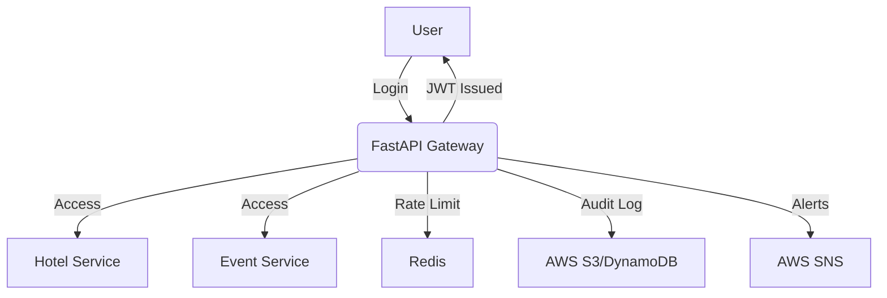
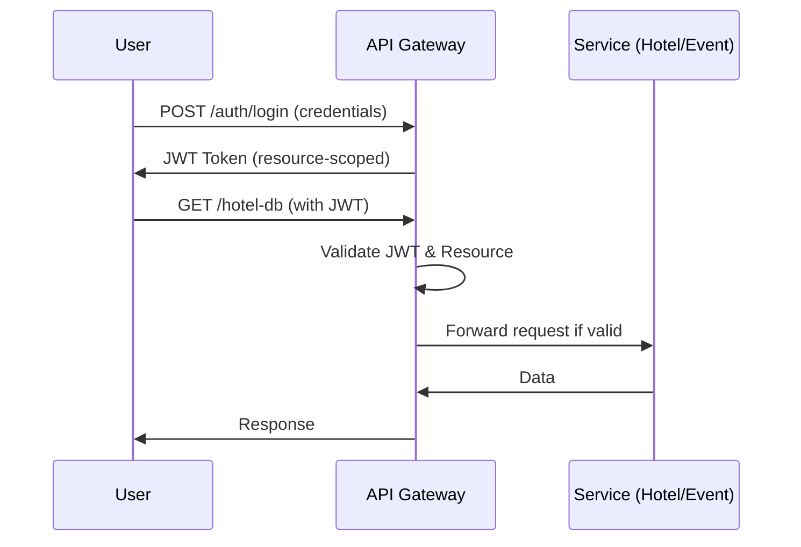
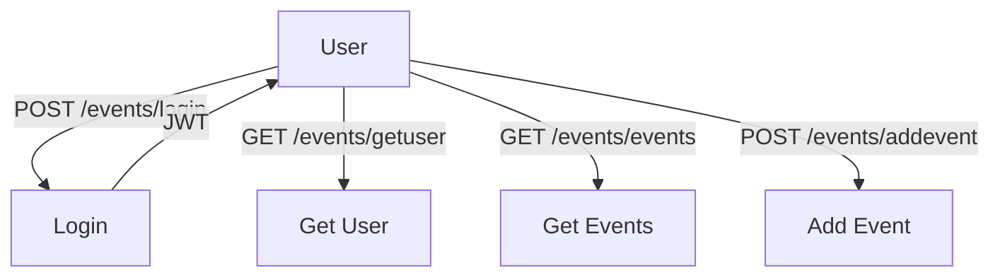

# 🔐 **Smart Resource Access Gateway**

[](https://github.com/your-username/smart-access-gateway/actions)
[](https://www.python.org/)
[](LICENSE)

---

## 🏗️ Architecture Overview



---

## 🎬 Project Walkthrough Videos

> **Watch the feature demos below:**

| ▶️ Feature                        | Video Link |
|-----------------------------------|------------|
| 🧠 Intro & Project Setup          | [Watch](https://www.loom.com/share/4560dc9c0512475a807ecb0e989af0cb?sid=6b30c01a-62ad-47cd-86b7-e237c40c4fd1) |
| 📦 Databases & Setup              | [Watch](https://www.loom.com/share/4131970b521e479da35a90d11a20eb33?sid=36e4df4d-dfbb-4698-b359-e2c99d8c5c09) |
| 🎫 JWT Encoding                   | [Watch](https://www.loom.com/share/2970c725894a40ccbc9ada1b1b7ab181?sid=b89c08ba-8d95-4bd5-9958-5b605d350b0d) |
| 🔑 Hash & JWT Decoding            | [Watch](https://www.loom.com/share/72d0465376644404b62d102005dd7450?sid=b00bb99e-bd63-414f-a1bb-4e4f64f7fc9a) |
| 🐳 Dockerizing App                | [Watch](https://www.loom.com/share/a30837310ccd43a2922f35b71b789caf?sid=b787a969-2d72-482d-b177-47fb1a313efe) |

---

## 🚀 Features at a Glance

| 🔒 Auth | 🎫 JWT | 🚦 Rate Limit | 🪣 Audit Log | 🚨 Alerts | 🐳 Docker | ☁️ AWS Ready |
|---------|--------|--------------|-------------|-----------|-----------|-------------|
| ✅      | ✅     | ✅           | ✅          | ✅        | ✅        | ✅          |

---

## 🧠 Project Overview

- 🔑 Authenticates users via `username + password`
- 🎫 Issues **JWT tokens** scoped to specific resources (e.g., `hotel`, `event`)
- 🛡️ Validates tokens on protected endpoints
- 🪣 Logs all access (audit logs)
- 🚨 Sends alerts for abuse
- ☁️ Fully deployable to AWS (ECS + Secrets + S3 + CloudWatch)

---

## 🔄 JWT Flow



---

## ⚡ Quick Start Checklist

- [x] Clone repo & install dependencies
- [x] Run FastAPI app
- [x] Start Redis for rate limiting
- [ ] Configure AWS (optional, for advanced features)

---

## 📦 Tech Stack

| Layer         | Tech                  |
|---------------|-----------------------|
| Web Framework | FastAPI + Uvicorn     |
| Auth          | JWT (`python-jose`)   |
| Rate Limiting | Redis                 |
| Logging       | AWS S3 / DynamoDB     |
| Alerts        | AWS SNS               |
| Deployment    | Docker + ECS + ECR    |
| Secrets       | AWS Secrets Manager   |
| CI/CD         | GitHub Actions        |

---

## 🧑‍💻 Event API Endpoints

> **Note:** 🏨 Hotel endpoints are **not yet implemented**. The following endpoints are for the Event system only.

### 📊 Visual API Flow



---

### 📋 Endpoint Summary Table

| Method | Path                  | Description                | Auth Required |
|--------|-----------------------|----------------------------|:-------------:|
| POST   | /events/login         | Login, get JWT             |      ❌       |
| GET    | /events/getuser       | Get current user info      |      ✅       |
| GET    | /events/getalluser    | Get all users              |      ❌       |
| POST   | /events/adduser       | Add user (superuser only)  |      ✅       |
| GET    | /events/events        | Get all events             |      ✅       |
| POST   | /events/addevent      | Add event                  |      ❌       |
| GET    | /events/orginfo       | Get org info               |      ❌       |
| PUT    | /events/orginfo       | Update org info            |      ❌       |
| GET    | /events/participants  | Get all participants       |      ❌       |
| GET    | /events/getupi        | Get all UPI IDs            |      ❌       |
| POST   | /events/addupi        | Add UPI ID                 |      ❌       |
| PUT    | /events/updateupi     | Update UPI ID              |      ❌       |
| DELETE | /events/deleteupi     | Delete UPI ID              |      ❌       |

---

### 📝 Endpoint Details

#### 1. 🔑 **POST /events/login**
Authenticate and get a JWT token.

**Request:**
```json
{
  "username": "saad",
  "password": "1234"
}
```
**Response:**
```json
{
  "Token": "Bearer <JWT>",
  "Token Type": "access/jwt"
}
```

#### 2. 👤 **GET /events/getuser**
Get current user info (JWT required).

**Header:**
```
Authorization: Bearer <JWT>
```
**Response:**
```json
{
  "id": 1,
  "username": "saad",
  ...
}
```

#### 3. 👥 **GET /events/getalluser**
Get all users.

**Response:**
```json
[
  { "id": 1, "username": "saad", ... },
  { "id": 2, "username": "alex", ... }
]
```

#### 4. ➕ **POST /events/adduser**
Add a new user (superuser JWT required).

**Request:**
```json
{
  "username": "alex",
  "password": "pass",
  "email": "alex@email.com",
  "first_name": "Alex",
  "last_name": "Smith"
}
```
**Response:**
```json
{ "User Added Succesfully" }
```

#### 5. 🗓️ **GET /events/events**
Get all events (JWT required).

**Response:**
```json
[
  {
    "title": "Chess Tournament",
    "max_participants": 100,
    "status": "published",
    ...
  }
]
```

#### 6. 🆕 **POST /events/addevent**
Add a new event.

**Request:**
```json
{
  "title": "Chess Tournament",
  "max_participants": 100,
  "status": "published",
  ...
}
```

#### 7. 🏢 **GET /events/orginfo**
Get organization info.

**Response:**
```json
{
  "name": "Event Org",
  "add": "123 Main St",
  "wp": "+1234567890",
  "email": "org@email.com"
}
```

#### 8. 🏢 **PUT /events/orginfo**
Update organization info.

**Request:**
```json
{
  "name": "Event Org",
  "add": "123 Main St",
  "wp": "+1234567890",
  "email": "org@email.com"
}
```
**Response:**
```json
{ "Details Updated Sucessfully" }
```

#### 9. 🧑‍🤝‍🧑 **GET /events/participants**
Get all participants.

**Response:**
```json
[
  {
    "full_name": "John Doe",
    "registration_id": "...",
    "status": "registered",
    ...
  }
]
```

#### 10. 🏦 **GET /events/getupi**
Get all UPI IDs.

**Response:**
```json
[
  { "id": 1, "name": "Org UPI", "upi_id": "org@upi", "nickname": "main" }
]
```

#### 11. ➕ **POST /events/addupi**
Add a new UPI ID.

**Request:**
```json
{
  "name": "Org UPI",
  "upi_id": "org@upi",
  "nickname": "main"
}
```
**Response:**
```json
{ "Success" }
```

#### 12. ✏️ **PUT /events/updateupi**
Update a UPI ID.

**Request:**
```json
{
  "id": 1,
  "name": "Org UPI",
  "upi_id": "org@upi",
  "nickname": "main"
}
```
**Response:**
```json
{ "details": "UPI ID updated Successfully" }
```

#### 13. ❌ **DELETE /events/deleteupi**
Delete a UPI ID.

**Query Param:** `id=1`

**Response:**
```json
{ "details": "UPI ID deleted Successfully" }
```

---

### 🧾 JWT Structure
```json
{
  "sub": "user_123",
  "resource": "hotel",
  "exp": 1725693217
}
```
- `sub` – user ID
- `resource` – the resource this token is scoped to (e.g., hotel, event)
- `exp` – expiration timestamp

---

## ⚙️ Setup & Run

### 1. Clone & Install
```bash
git clone https://github.com/your-username/smart-access-gateway.git
cd smart-access-gateway
python -m venv .venv
source .venv/bin/activate  # On Windows: .venv\Scripts\activate
pip install -r requirements.txt
```

### 2. Run App
```bash
uvicorn main:app --reload
```

### 3. Redis (for rate limiting)
```bash
docker run -d -p 6379:6379 redis
```

---

## 🌩️ AWS Integration (Advanced)

| Feature  | Service                |
|----------|------------------------|
| Secrets  | AWS Secrets Manager    |
| Logs     | AWS S3 / DynamoDB      |
| Alerts   | AWS SNS                |
| Hosting  | ECS Fargate or EC2     |
| CI/CD    | GitHub Actions         |
| Metrics  | AWS CloudWatch         |

---

## 📁 Folder Structure

```text
project/
├── main.py
├── routers/         # 🚦 API Routers
│   ├── events.py
│   ├── hotels.py
│   ├── jwtSec.py
│   └── test.py
├── config/          # ⚙️ Config & Dependencies
│   ├── authentication.py
│   └── dependencies.py
├── models/          # 🗄️ Data Models
│   ├── djangomodels.py
│   ├── Emodels.py
│   └── Hmodels.py
├── structure/       # 🏗️ Domain Structures
│   ├── Event.py
│   └── Hotel.py
├── testing/         # 🧪 Tests & Hashing
│   ├── __init__.py
│   ├── hashing.py
│   └── testmain.py
├── requirements.txt
├── Dockerfile
└── readme.md
```

---

## 🧠 Future Ideas
- 🔁 Refresh token support
- 🔒 Role-based permissions (admin, guest)
- 🚧 Token revocation via Redis
- 🧩 Multi-tenant resource logic

---

## 🧑‍🎓 Author
**Mohammad Saad**  
Backend + Cloud + Security Enthusiast  
🌐 GitHub: [@saad1901](https://github.com/saad1901)  
📌 LinkedIn: [https://www.linkedin.com/in/saad99]