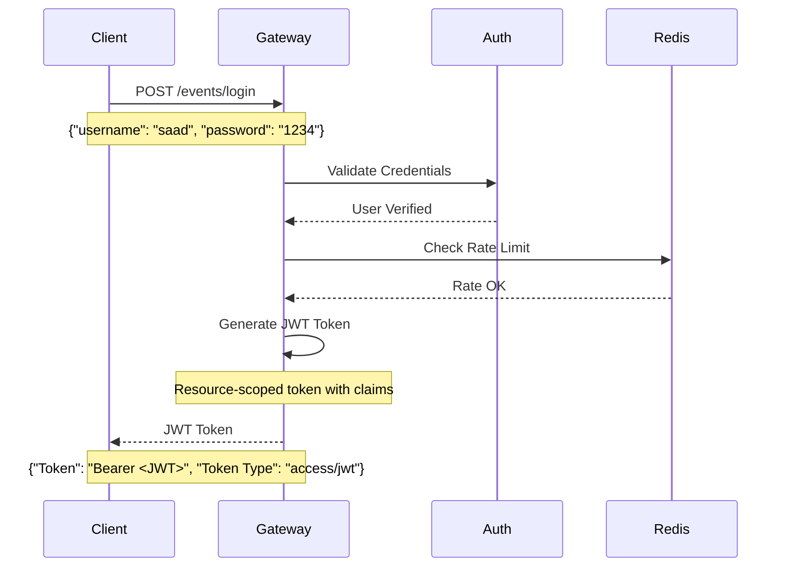
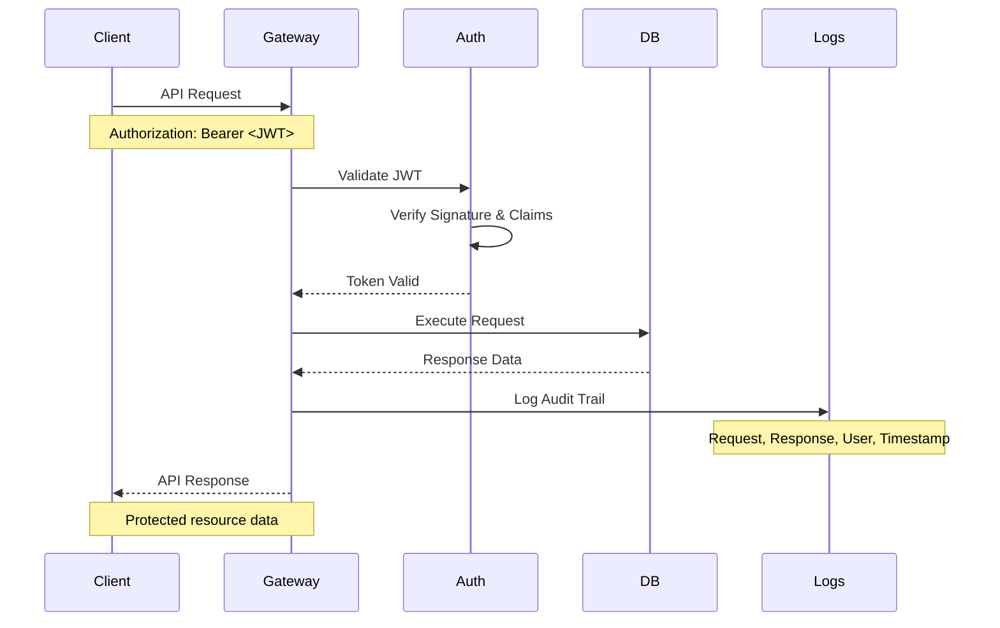
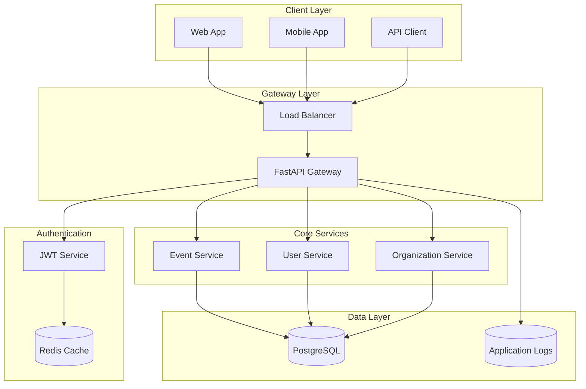

# 🚀✨ Smart Resource Access Gateway ✨🚀

<div align="center">

> **A blazing-fast, secure API gateway for resource-scoped JWT authentication, event management, and more!**

[](https://github.com/your-username/smart-access-gateway/actions)
[](https://www.python.org/)
[](https://fastapi.tiangolo.com/)
[](LICENSE)
[](https://redis.io/)

</div>

---

## 📖 About This Project

**Smart Resource Access Gateway** is a production-ready FastAPI-based API gateway that provides:

- 🔐 **JWT Authentication** with resource-scoped tokens
- 🎯 **Event Management** with comprehensive CRUD operations
- ⚡ **Rate Limiting** powered by Redis
- 📊 **Audit Logging** for request tracking
- ☁️ **Cloud-Native** architecture for scalability
- 🛡️ **Security-First** design principles

---

## 🔄 Authentication & Request Flow

### 1️⃣ JWT Authentication Flow



### 2️⃣ Authenticated Request Flow



---

## 🛠️ API Endpoints

> **⚠️ Note:** Hotel endpoints are planned but not yet implemented. Current focus is on the Event management system.

### 🔑 Authentication Endpoints

| Method | Endpoint | Description | Auth Required |
|--------|----------|-------------|---------------|
| `POST` | `/events/login` | Authenticate user and get JWT | ❌ |

<details>
<summary><b>🔑 POST /events/login</b> - User Authentication</summary>

**Request Body:**
```json
{
  "username": "saad",
  "password": "1234"
}
```

**Response:**
```json
{
  "Token": "Bearer eyJhbGciOiJIUzI1NiIsInR5cCI6IkpXVCJ9...",
  "Token Type": "access/jwt"
}
```

**Status Codes:**
- `200` - Authentication successful
- `401` - Invalid credentials
- `429` - Rate limit exceeded

</details>

### 👤 User Management

| Method | Endpoint | Description | Auth Required |
|--------|----------|-------------|---------------|
| `GET` | `/events/getuser` | Get current user info | ✅ |
| `GET` | `/events/getalluser` | Get all users | ❌ |
| `POST` | `/events/adduser` | Add new user | ✅ (Superuser) |

<details>
<summary><b>👤 GET /events/getuser</b> - Get Current User</summary>

**Headers:**
```
Authorization: Bearer <JWT_TOKEN>
```

**Response:**
```json
{
  "id": 1,
  "username": "saad",
  "email": "saad@example.com",
  "first_name": "Saad",
  "last_name": "Mohammad",
  "is_active": true,
  "created_at": "2024-01-15T10:30:00Z"
}
```

</details>

<details>
<summary><b>👥 GET /events/getalluser</b> - Get All Users</summary>

**Response:**
```json
[
  {
    "id": 1,
    "username": "saad",
    "email": "saad@example.com",
    "first_name": "Saad",
    "last_name": "Mohammad"
  },
  {
    "id": 2,
    "username": "alex",
    "email": "alex@example.com",
    "first_name": "Alex",
    "last_name": "Smith"
  }
]
```

</details>

<details>
<summary><b>➕ POST /events/adduser</b> - Add New User</summary>

**Headers:**
```
Authorization: Bearer <SUPERUSER_JWT_TOKEN>
```

**Request Body:**
```json
{
  "username": "alex",
  "password": "securepass123",
  "email": "alex@example.com",
  "first_name": "Alex",
  "last_name": "Smith"
}
```

**Response:**
```json
{
  "message": "User Added Successfully",
  "user_id": 3
}
```

</details>

### 🗓️ Event Management

| Method | Endpoint | Description | Auth Required |
|--------|----------|-------------|---------------|
| `GET` | `/events/events` | Get all events | ✅ |
| `POST` | `/events/addevent` | Create new event | ✅ |

<details>
<summary><b>🗓️ GET /events/events</b> - Get All Events</summary>

**Headers:**
```
Authorization: Bearer <JWT_TOKEN>
```

**Response:**
```json
[
  {
    "id": 1,
    "title": "Chess Tournament 2024",
    "description": "Annual chess championship",
    "max_participants": 100,
    "current_participants": 45,
    "status": "published",
    "start_date": "2024-03-15T09:00:00Z",
    "end_date": "2024-03-17T18:00:00Z",
    "location": "Main Auditorium",
    "created_by": "saad"
  }
]
```

</details>

<details>
<summary><b>🆕 POST /events/addevent</b> - Create New Event</summary>

**Headers:**
```
Authorization: Bearer <JWT_TOKEN>
```

**Request Body:**
```json
{
  "title": "Chess Tournament 2024",
  "description": "Annual chess championship",
  "max_participants": 100,
  "status": "draft",
  "start_date": "2024-03-15T09:00:00Z",
  "end_date": "2024-03-17T18:00:00Z",
  "location": "Main Auditorium"
}
```

**Response:**
```json
{
  "message": "Event Created Successfully",
  "event_id": 1,
  "status": "draft"
}
```

</details>

### 🏢 Organization Management

| Method | Endpoint | Description | Auth Required |
|--------|----------|-------------|---------------|
| `GET` | `/events/orginfo` | Get organization info | ❌ |
| `PUT` | `/events/orginfo` | Update organization info | ✅ |

<details>
<summary><b>🏢 GET /events/orginfo</b> - Get Organization Info</summary>

**Response:**
```json
{
  "name": "Event Management Org",
  "address": "123 Main Street, City, State 12345",
  "whatsapp": "+1234567890",
  "email": "contact@eventorg.com",
  "website": "https://eventorg.com",
  "established": "2020-01-01"
}
```

</details>

### 🧑‍🤝‍🧑 Participant Management

| Method | Endpoint | Description | Auth Required |
|--------|----------|-------------|---------------|
| `GET` | `/events/participants` | Get all participants | ✅ |

<details>
<summary><b>🧑‍🤝‍🧑 GET /events/participants</b> - Get All Participants</summary>

**Headers:**
```
Authorization: Bearer <JWT_TOKEN>
```

**Response:**
```json
[
  {
    "id": 1,
    "full_name": "John Doe",
    "email": "john@example.com",
    "registration_id": "REG-2024-001",
    "event_id": 1,
    "event_title": "Chess Tournament 2024",
    "status": "registered",
    "registration_date": "2024-01-20T14:30:00Z"
  }
]
```

</details>

### 🏦 Payment Integration (UPI)

| Method | Endpoint | Description | Auth Required |
|--------|----------|-------------|---------------|
| `GET` | `/events/getupi` | Get all UPI IDs | ❌ |
| `POST` | `/events/addupi` | Add new UPI ID | ✅ |
| `PUT` | `/events/updateupi` | Update UPI ID | ✅ |
| `DELETE` | `/events/deleteupi/{id}` | Delete UPI ID | ✅ |

<details>
<summary><b>🏦 UPI Management Endpoints</b></summary>

**GET /events/getupi Response:**
```json
[
  {
    "id": 1,
    "name": "Organization UPI",
    "upi_id": "eventorg@paytm",
    "nickname": "main",
    "is_active": true
  }
]
```

**POST /events/addupi Request:**
```json
{
  "name": "Secondary UPI",
  "upi_id": "backup@phonepe",
  "nickname": "backup"
}
```

</details>

---

## 🚀 Getting Started

### Prerequisites

- Python 3.9+
- Redis Server
- Database (PostgreSQL recommended)

### Quick Start

```bash
# Clone the repository
git clone https://github.com/saad1901/smart-access-gateway.git
cd smart-access-gateway

# Install dependencies
pip install -r requirements.txt

# Set environment variables
export DATABASE_URL="your_database_url"
export REDIS_URL="your_redis_url"
export JWT_SECRET_KEY="your_secret_key"

# Run the application
uvicorn main:app --reload
```

### Environment Variables

| Variable | Description | Required |
|----------|-------------|----------|
| `DATABASE_URL` | Database connection string | ✅ |
| `REDIS_URL` | Redis connection string | ✅ |
| `JWT_SECRET_KEY` | Secret key for JWT signing | ✅ |
| `RATE_LIMIT_REQUESTS` | Max requests per minute | ❌ (default: 100) |

---

## 🏗️ Architecture



---

## 🛡️ Security Features

- **🔐 JWT Authentication**: Resource-scoped tokens with configurable expiration
- **⚡ Rate Limiting**: Redis-based request throttling
- **📊 Audit Logging**: Complete request/response logging
- **🔒 CORS Protection**: Configurable cross-origin resource sharing
- **🛡️ Input Validation**: Pydantic models for request validation

---

## 🧠 Roadmap & Future Ideas

### 🔄 Authentication Enhancements
- [ ] Refresh token support with automatic rotation
- [ ] Multi-factor authentication (MFA)
- [ ] OAuth2 integration (Google, GitHub, Microsoft)
- [ ] Session management with Redis

### 🔐 Security Improvements
- [ ] Role-based access control (RBAC)
- [ ] API key management
- [ ] Token revocation lists
- [ ] Advanced rate limiting with user tiers

### 🏗️ Architecture Upgrades
- [ ] Microservices decomposition
- [ ] Event-driven architecture with message queues
- [ ] GraphQL API support
- [ ] Multi-tenant resource isolation

### 📊 Monitoring & Analytics
- [ ] Real-time dashboards
- [ ] Performance metrics
- [ ] Usage analytics
- [ ] Health check endpoints

### 🚀 Deployment & DevOps
- [ ] Docker containerization
- [ ] Kubernetes deployment manifests
- [ ] CI/CD pipeline with GitHub Actions
- [ ] Infrastructure as Code (Terraform)

### ☁️ Cloud Integration (Future)
- [ ] AWS S3 integration for audit logging
- [ ] DynamoDB for scalable data storage
- [ ] AWS SNS for real-time alerting
- [ ] CloudWatch for monitoring and metrics

---

## 📄 API Documentation

### Interactive Documentation
- **Swagger UI**: `/docs` (when server is running)
- **ReDoc**: `/redoc` (when server is running)

### Response Format Standards

**Success Response:**
```json
{
  "success": true,
  "data": { ... },
  "message": "Operation completed successfully"
}
```

**Error Response:**
```json
{
  "success": false,
  "error": {
    "code": "VALIDATION_ERROR",
    "message": "Invalid input provided",
    "details": { ... }
  }
}
```

**Status Codes:**
- `200` - Success
- `201` - Created
- `400` - Bad Request
- `401` - Unauthorized
- `403` - Forbidden
- `404` - Not Found
- `429` - Too Many Requests
- `500` - Internal Server Error

---

## 🤝 Contributing

We welcome contributions! Please see our [Contributing Guidelines](CONTRIBUTING.md) for details.

### Development Setup

```bash
# Fork and clone the repo
git clone https://github.com/YOUR_USERNAME/smart-access-gateway.git

# Create a virtual environment
python -m venv venv
source venv/bin/activate  # On Windows: venv\Scripts\activate

# Install development dependencies
pip install -r requirements-dev.txt

# Run tests
pytest

# Run linting
flake8 src/
black src/

# Start development server
uvicorn main:app --reload --host 0.0.0.0 --port 8000
```

---

## 👨‍💻 Author & Maintainer

<div align="center">

**Mohammad Saad**  
*Backend + Cloud + Security Enthusiast*

[](https://github.com/saad1901)
[](https://www.linkedin.com/in/saad99)
[](mailto:saadiqbal1921@gmail.com)

---

<p>
  <b>⭐ If you found this project helpful, please give it a star! ⭐</b><br>
  <sub>Made with ❤️ by Saad</sub>
</p>

</div>