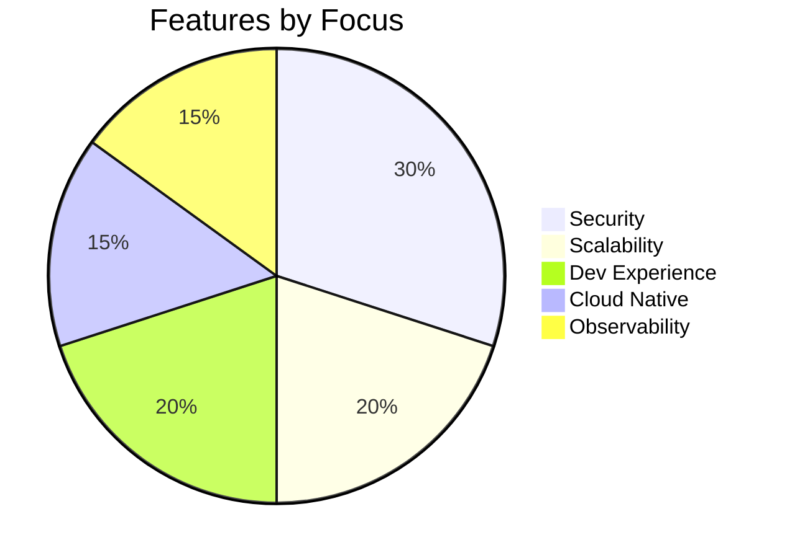
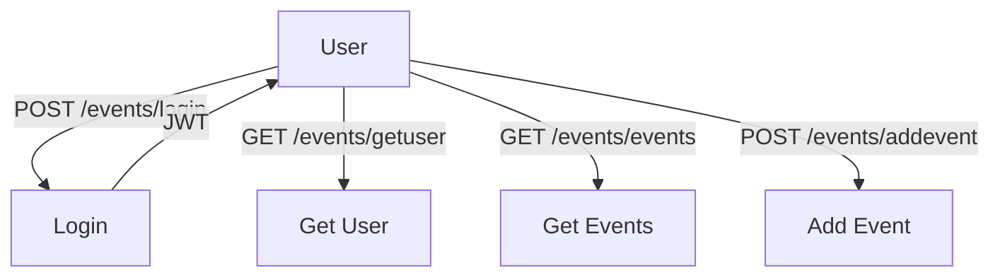

# 🚀✨ **Smart Resource Access Gateway** ✨🚀

```
   _____                      _     _   _                 _        
  / ____|                    | |   | | (_)               | |       
 | (___   ___  __ _ _ __ ___ | |__ | |_ _ _ __ ___   __ _| |_ ___  
  \___ \ / _ \/ _` | '_ ` _ \| '_ \| __| | '_ ` _ \ / _` | __/ _ \ 
  ____) |  __/ (_| | | | | | | |_) | |_| | | | | | | (_| | ||  __/ 
 |_____/ \___|\__,_|_| |_| |_|_.__/ \__|_|_| |_| |_|\__,_|\__\___| 
```

> **A blazing-fast, secure API gateway for resource-scoped JWT authentication, event management, and more!**

[](https://github.com/your-username/smart-access-gateway/actions)
[](https://www.python.org/)
[](LICENSE)

---

🌟🌈🌟🌈🌟🌈🌟🌈🌟🌈🌟🌈🌟🌈🌟🌈🌟

## 💡 Why Use This Gateway?

- ✅ **Production-ready** FastAPI backend
- 🔒 **JWT authentication** (resource-scoped)
- 🚦 **Rate limiting** (Redis-powered)
- 🪣 **Audit logging** (AWS S3/DynamoDB)
- 🚨 **Abuse alerts** (SNS)
- 🐳 **Dockerized** for easy deployment
- ☁️ **AWS-ready** (ECS, Secrets, S3, CloudWatch)
- 🧑‍💻 **Developer-friendly** endpoints
- 🏆 **Battle-tested** for event management

> **_"Plug, play, and protect your microservices with style!"_**

🌟🌈🌟🌈🌟🌈🌟🌈🌟🌈🌟🌈🌟🌈🌟🌈🌟

---

## ⚡ Quickstart Checklist

- [x] 🛒 **Clone repo & install dependencies**
- [x] 🚀 **Run FastAPI app**
- [x] 🟢 **Start Redis for rate limiting**
- [ ] ☁️ **Configure AWS (optional, for advanced features)**

---

## 🧩 What You Get

| 🔒 Auth | 🎫 JWT | 🚦 Rate Limit | 🪣 Audit Log | 🚨 Alerts | 🐳 Docker | ☁️ AWS Ready |
|---------|--------|--------------|-------------|-----------|-----------|-------------|
| ✅      | ✅     | ✅           | ✅          | ✅        | ✅        | ✅          |

---

## 🥧 Feature Distribution



---

## 🧑‍💻 Event API Endpoints

> **Note:** 🏨 Hotel endpoints are **not yet implemented**. The following endpoints are for the Event system only.

### 📊 Visual API Flow



---

### 📋 Endpoint Summary Table

| Method | Path                  | Description                | Auth |
|--------|-----------------------|----------------------------|:----:|
| 🟢 POST   | `/events/login`         | Login, get JWT             |  ❌  |
| 🔵 GET    | `/events/getuser`       | Get current user info      |  ✅  |
| 🔵 GET    | `/events/getalluser`    | Get all users              |  ❌  |
| 🟢 POST   | `/events/adduser`       | Add user (superuser only)  |  ✅  |
| 🔵 GET    | `/events/events`        | Get all events             |  ✅  |
| 🟢 POST   | `/events/addevent`      | Add event                  |  ❌  |
| 🔵 GET    | `/events/orginfo`       | Get org info               |  ❌  |
| 🟡 PUT    | `/events/orginfo`       | Update org info            |  ❌  |
| 🔵 GET    | `/events/participants`  | Get all participants       |  ❌  |
| 🔵 GET    | `/events/getupi`        | Get all UPI IDs            |  ❌  |
| 🟢 POST   | `/events/addupi`        | Add UPI ID                 |  ❌  |
| 🟡 PUT    | `/events/updateupi`     | Update UPI ID              |  ❌  |
| 🔴 DELETE | `/events/deleteupi`     | Delete UPI ID              |  ❌  |

---

### 📝 Endpoint Details

<details>
<summary>🔑 <b>POST /events/login</b></summary>

Authenticate and get a JWT token.

**Request:**
```json
{
  "username": "saad",
  "password": "1234"
}
```
**Response:**
```json
{
  "Token": "Bearer <JWT>",
  "Token Type": "access/jwt"
}
```
</details>

<details>
<summary>👤 <b>GET /events/getuser</b></summary>

Get current user info (JWT required).

**Header:**
```
Authorization: Bearer <JWT>
```
**Response:**
```json
{
  "id": 1,
  "username": "saad",
  ...
}
```
</details>

<details>
<summary>👥 <b>GET /events/getalluser</b></summary>

Get all users.

**Response:**
```json
[
  { "id": 1, "username": "saad", ... },
  { "id": 2, "username": "alex", ... }
]
```
</details>

<details>
<summary>➕ <b>POST /events/adduser</b></summary>

Add a new user (superuser JWT required).

**Request:**
```json
{
  "username": "alex",
  "password": "pass",
  "email": "alex@email.com",
  "first_name": "Alex",
  "last_name": "Smith"
}
```
**Response:**
```json
{ "User Added Succesfully" }
```
</details>

<details>
<summary>🗓️ <b>GET /events/events</b></summary>

Get all events (JWT required).

**Response:**
```json
[
  {
    "title": "Chess Tournament",
    "max_participants": 100,
    "status": "published",
    ...
  }
]
```
</details>

<details>
<summary>🆕 <b>POST /events/addevent</b></summary>

Add a new event.

**Request:**
```json
{
  "title": "Chess Tournament",
  "max_participants": 100,
  "status": "published",
  ...
}
```
</details>

<details>
<summary>🏢 <b>GET /events/orginfo</b></summary>

Get organization info.

**Response:**
```json
{
  "name": "Event Org",
  "add": "123 Main St",
  "wp": "+1234567890",
  "email": "org@email.com"
}
```
</details>

<details>
<summary>🏢 <b>PUT /events/orginfo</b></summary>

Update organization info.

**Request:**
```json
{
  "name": "Event Org",
  "add": "123 Main St",
  "wp": "+1234567890",
  "email": "org@email.com"
}
```
**Response:**
```json
{ "Details Updated Sucessfully" }
```
</details>

<details>
<summary>🧑‍🤝‍🧑 <b>GET /events/participants</b></summary>

Get all participants.

**Response:**
```json
[
  {
    "full_name": "John Doe",
    "registration_id": "...",
    "status": "registered",
    ...
  }
]
```
</details>

<details>
<summary>🏦 <b>GET /events/getupi</b></summary>

Get all UPI IDs.

**Response:**
```json
[
  { "id": 1, "name": "Org UPI", "upi_id": "org@upi", "nickname": "main" }
]
```
</details>

<details>
<summary>➕ <b>POST /events/addupi</b></summary>

Add a new UPI ID.

**Request:**
```json
{
  "name": "Org UPI",
  "upi_id": "org@upi",
  "nickname": "main"
}
```
**Response:**
```json
{ "Success" }
```
</details>

<details>
<summary>✏️ <b>PUT /events/updateupi</b></summary>

Update a UPI ID.

**Request:**
```json
{
  "id": 1,
  "name": "Org UPI",
  "upi_id": "org@upi",
  "nickname": "main"
}
```
**Response:**
```json
{ "details": "UPI ID updated Successfully" }
```
</details>

<details>
<summary>❌ <b>DELETE /events/deleteupi</b></summary>

Delete a UPI ID.

**Query Param:** `id=1`

**Response:**
```json
{ "details": "UPI ID deleted Successfully" }
```
</details>

---

## 🗂️ Folder Structure

```text
project/
├── main.py
├── routers/         # 🚦 API Routers
│   ├── events.py
│   ├── hotels.py
│   ├── jwtSec.py
│   └── test.py
├── config/          # ⚙️ Config & Dependencies
│   ├── authentication.py
│   └── dependencies.py
├── models/          # 🗄️ Data Models
│   ├── djangomodels.py
│   ├── Emodels.py
│   └── Hmodels.py
├── structure/       # 🏗️ Domain Structures
│   ├── Event.py
│   └── Hotel.py
├── testing/         # 🧪 Tests & Hashing
│   ├── __init__.py
│   ├── hashing.py
│   └── testmain.py
├── requirements.txt
├── Dockerfile
└── readme.md
```

---

## 🧠 Future Ideas
- 🔁 Refresh token support
- 🔒 Role-based permissions (admin, guest)
- 🚧 Token revocation via Redis
- 🧩 Multi-tenant resource logic

---

## 👨‍💻 Author & Credits

**Mohammad Saad**  
Backend + Cloud + Security Enthusiast  
[](https://github.com/saad1901)  
[](https://www.linkedin.com/in/saad99)

---

<p align="center">
  Made with ❤️ by Mohammad Saad
</p>